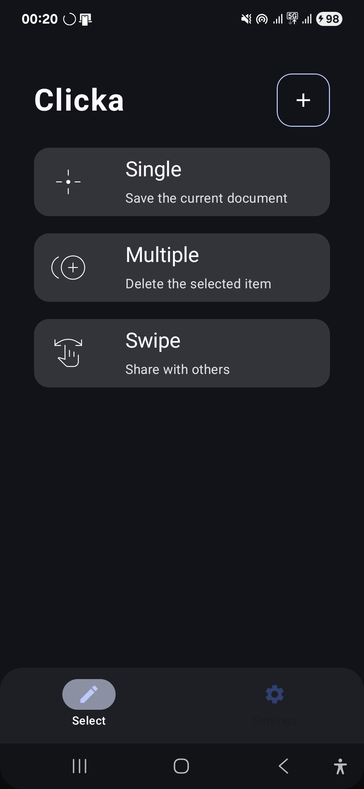

# Clicka 🖱️

An Android auto-clicker application built with Kotlin, Jetpack Compose, and modern Android architecture.

## Screenshot

<p align="center">
  
</p>

## Features

- **Auto Click** - Automatically click at specified coordinates
- **Swipe Actions** - Configure swipe gestures with start/end points
- **Custom Scenarios** - Create and save multiple click/swipe scenarios
- **Floating Overlay** - Control auto-clicking from anywhere on your device
- **Accessibility Service** - Reliable gesture dispatch via Android's Accessibility API

## Architecture

The app follows a clean, domain-driven architecture:

```
┌─────────────────────────────────────────────────────────┐
│                    UI Layer                             │
│  (Jetpack Compose Screens, Navigation, Overlays)        │
└─────────────────────────┬───────────────────────────────┘
                          │
┌─────────────────────────▼───────────────────────────────┐
│                  Domain Layer                           │
│  (Scenarios, Actions, Click/Swipe/Pause definitions)    │
└─────────────────────────┬───────────────────────────────┘
                          │
┌─────────────────────────▼───────────────────────────────┐
│                  Engine Layer                           │
│  (ActionExecutor, Engine orchestration)                 │
└─────────────────────────┬───────────────────────────────┘
                          │
┌─────────────────────────▼───────────────────────────────┐
│              Accessibility Service                      │
│  (dispatchGesture for clicks/swipes)                    │
└─────────────────────────────────────────────────────────┘
```

## Tech Stack

- **Language**: Kotlin
- **UI**: Jetpack Compose
- **Database**: Room (with KSP)
- **Architecture**: MVVM / Domain-based
- **Min SDK**: 33 (Android 13)
- **Target SDK**: 36

## Permissions

| Permission | Purpose |
|------------|---------|
| `SYSTEM_ALERT_WINDOW` | For floating overlay control panel |
| `BIND_ACCESSIBILITY_SERVICE` | For gesture dispatch (clicks/swipes) |

## Project Structure

```
com.example.clicka/
├── actions/          # Action definitions (Click, Swipe, Pause)
├── base/             # Base classes and utilities
├── data/             # Database, DAOs, repositories
├── domain/           # Domain models (Scenario, Action)
├── engine/           # Engine & ActionExecutor
├── navigation/       # Navigation components
├── screens/          # Compose UI screens
├── services/
│   ├── accessibilty/ # Accessibility service
│   └── overlayservice/ # Floating overlay service
└── ui/               # UI components & themes
```

## Setup

1. Clone the repository
   ```bash
   git clone https://github.com/yourusername/Clicka.git
   ```

2. Open in Android Studio (Hedgehog or newer recommended)

3. Sync Gradle dependencies

4. Build and run on device/emulator (API 33+)

## Usage

1. **Grant Permissions** - Enable overlay and accessibility permissions when prompted
2. **Create Scenario** - Add click points or swipe actions
3. **Start Auto-Click** - Use the floating overlay to start/stop automation
4. **Customize** - Adjust delays and repeat settings as needed

## Building

```bash
# Debug build
./gradlew assembleDebug

# Release build
./gradlew assembleRelease
```

## Requirements

- Android Studio Hedgehog (2023.1.1) or newer
- JDK 11+
- Android device/emulator with API 33+

## How It Works

### Core Flow

1. **User Action** → User configures click/swipe points via UI
2. **Scenario Creation** → Actions are saved as a Scenario
3. **Engine Execution** → Engine processes the Scenario's actions
4. **Gesture Dispatch** → AccessibilityService dispatches gestures to the screen

### Key Components

- **`AutoClickAccessibilityService`** - Handles gesture dispatch using Android's Accessibility API
- **`OverlayService`** - Manages the floating control overlay
- **`Engine`** - Orchestrates scenario execution
- **`ActionExecutor`** - Executes individual Click/Swipe/Pause actions

## Contributing

Contributions are welcome! Please feel free to submit a Pull Request.

## License

This project is for educational purposes.

---

<p align="center">Made with ❤️ using Kotlin & Jetpack Compose</p>

